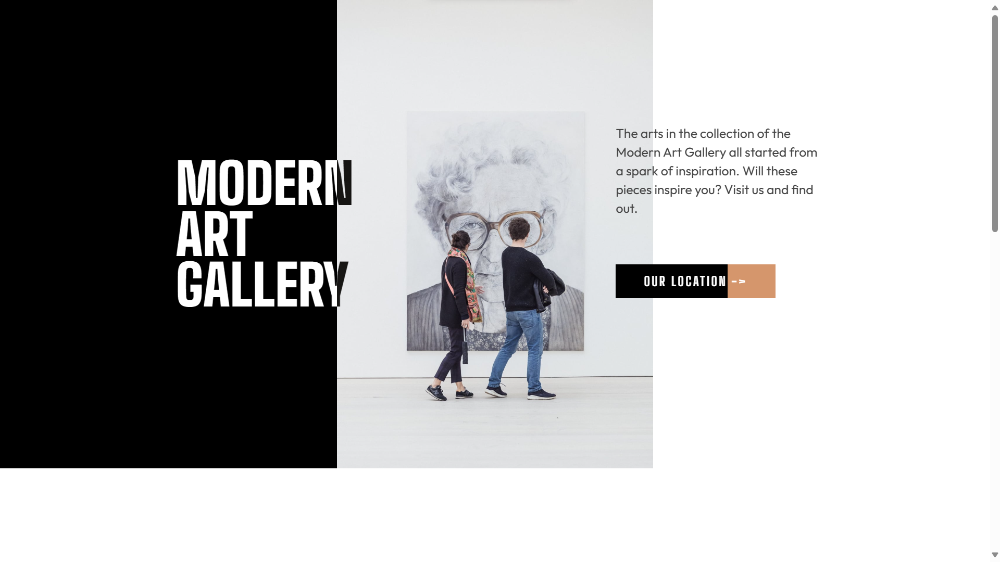
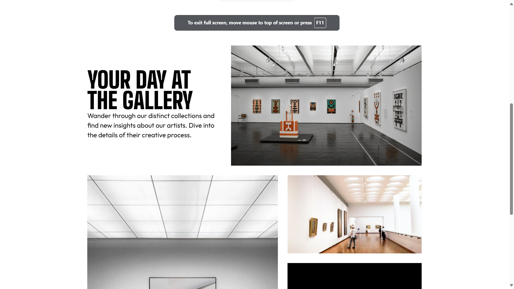
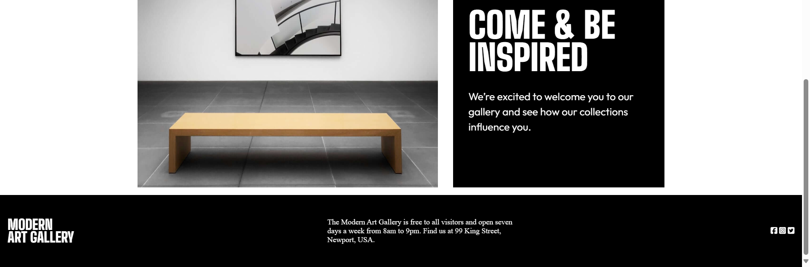

# Frontend Mentor - Modern Art Gallery Solution- Premium AfterMarketted🤫

This is a solution to the [Art Gallery Website](https://www.frontendmentor.io/challenges/art-gallery-website-yVdrZlxyA). Frontend Mentor challenges help you improve your coding skills by building realistic projects. 

### The challenge

Users should be able to:

- View the optimal layout depending on their device's screen size
- See hover and focus states for interactive elements

### Screenshot

### Links

- Live Site URL: [https://modern-art-galllery.netlify.app/](https://modern-art-galllery.netlify.app/)

## My process
Flowing with the Go

### Built with

- CSS custom properties
- Flexbox
- CSS Grid

## Author
- Frontend Mentor - [@AkshayDev](https://www.frontendmentor.io/profile/Akshoo)
